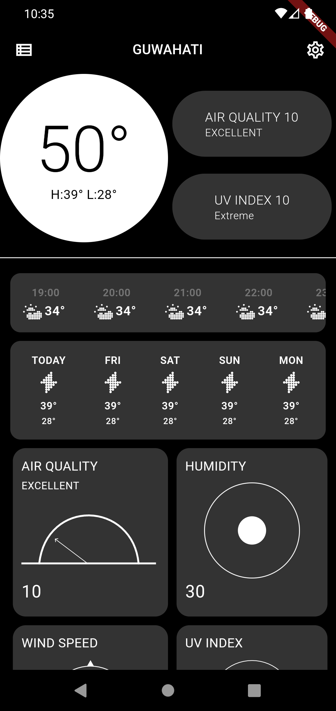
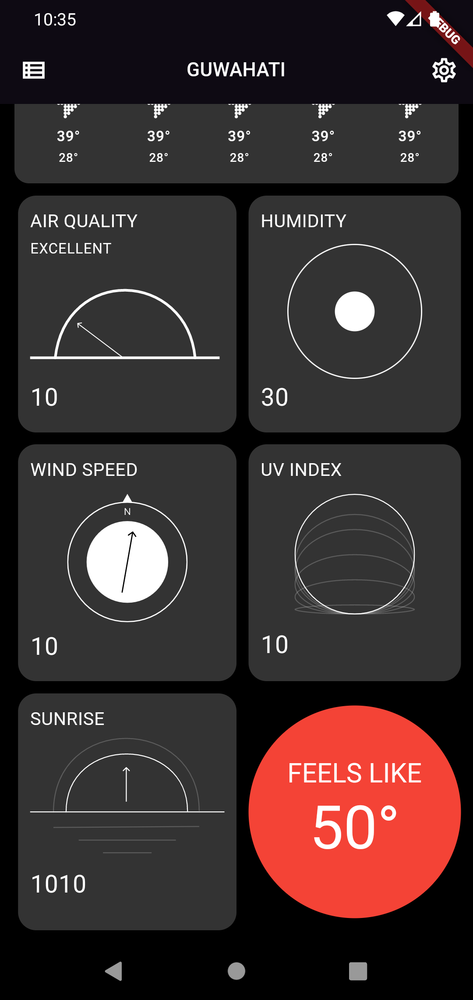

# weather_app

It is a simple weather app that would help you to find the current weather and also the future as well.
The app lets you add a place and delete the same. You can find the current temprature, reletive humidity and also "feels like" temprature.
It will also show the air quality index or AQI based on the european standard.
You can view the hourly temprature with the weather for each hour.

Tech stack used:- 
    Flutter for front end. 
    API Used:- https://open-meteo.com/
    SQL used to save the data locally.

TODO:-  
    1. ~~Add the API for weather~~  ✅  
    2. ~~Change the icons based on the weather codes.~~ ✅   
    3. ~~Add the API for AQI~~ ✅  
    4. ~~Add screen for different cities~~ ✅  
    5. ~~Add screen for settings for different parameters like kmph or mph / celcius or farenhite etc~~✅  
    6. Add support for choosing the city  
    7. Add support for checking if data is syncing or not  
    8. Store the cities in the phone locally  
    9. Store the last synced data in the phone  

Current Progress:-
     

## Getting Started

This project is a starting point for a Flutter application.

A few resources to get you started if this is your first Flutter project:

- [Lab: Write your first Flutter app](https://docs.flutter.dev/get-started/codelab)
- [Cookbook: Useful Flutter samples](https://docs.flutter.dev/cookbook)

For help getting started with Flutter development, view the
[online documentation](https://docs.flutter.dev/), which offers tutorials,
samples, guidance on mobile development, and a full API reference.
